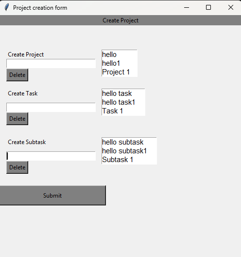
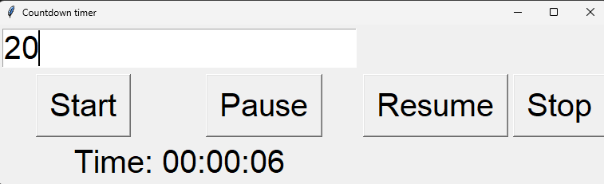
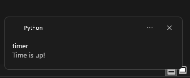
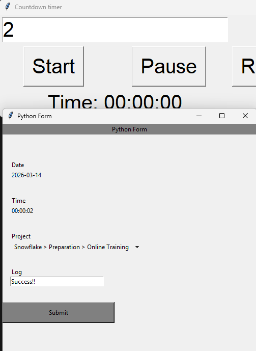

# timelog-app
### version 1.0 - without LLM integration

Timer app in python includes project planning and status of work updates. You can plan projects to do. You can track time spent on each project. You can track work done on those projects. 
 No setup required. Just download the release and unzip. Then follow the working below. 
 DISCLAIMER! this version does not save the time you spent working. So when time runs out and notification received, please log the progress of your work. Then set the timer with a new time limit. 
 
First you run the project form app and save the Project, tasks and subtasks related to the project. 
  
 
The Timer app itself as in the screenshot below which you run to keep track of time spent: 
   
 
You decide if you want to stop the timer or let it run till completion in which case you get a notification that time is up! 
  
 
You decide to which project/task/subtask you log this time to and record the progress made: 
  
